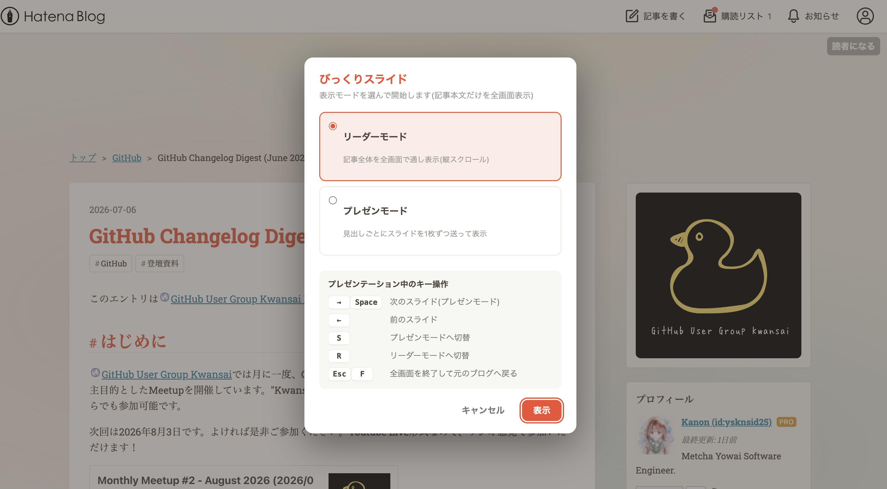
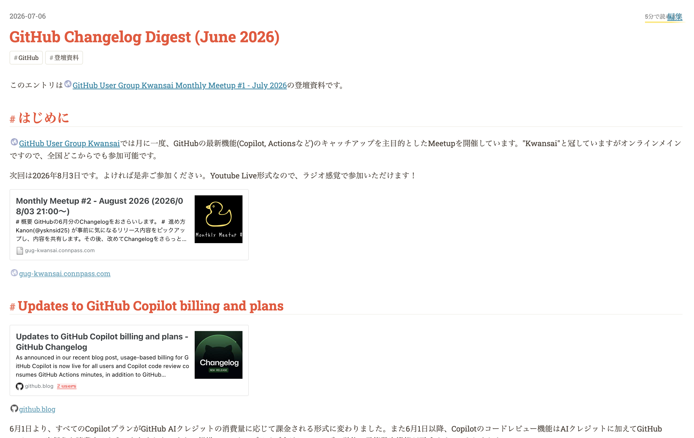

# bikkuri-slide (びっくりスライド)

はてなブログの記事をプレゼンテーションの場で使いたいと思ったことはありませんか？

しかし普通にプレゼンに使おうとした際、私自身、以下の点を課題に感じていました。

- サイドバー、ブログ見出し、ブログヘッダなど、プレゼン内容とは関係ないものまで映り込んでしまう
- 普通にブラウザで全画面表示してもブックマークバーが写りこんでしまうのでいちいち非表示にしないといけない
- 同様にchrome拡張で使っているものも映り込んでしまう

このリポジトリは以上の課題を解決し、はてなブログの記事をスライドでも使えるようにするためのchrome拡張機能です。はてなブログなどの記事本文だけを抜き出し、モニター全体の全画面でプレゼンテーション表示します。 

# 命名の理由

"はてなブログ"のスライドなので、"びっくりスライド"です。

個人的にはてなブログというのは、はてなの皆さんが"ブログ"であることにこだわり抜いて洗練しているサービスだと考えています。なので、名前の通り"ブログ"とついているものに対して、"はてなブログtoスライド"のような命名をすることに非常に抵抗がありました。

そして、"はてな"というキーワードを含めることもまた、利用者に対して"はてな"のサービスであると誤解を与えかねないため、非常に抵抗がありました。

以上から、ブログではなくスライド / はてなではないもの を洒落たつもりで"びっくりスライド"と名付けることにしました。

# びっくりスライド ができること

びっくりスライドには二つのモードがあります。これらは、拡張機能をクリックすることでどちらのモードか選択することができます。

また全画面モードの途中でもキー操作により「S」キーでスライドモードに。「R」キーでリーダーモードに素早く切り替えることができます。

びっくりスライドのモードから抜けるには「ESC」キーを押下します。

## リーダーモード

エントリ部分をそのまま全画面に表示することができます。一つ一つの見出しが長い場合や、複数の画像やサンプルコードを見せたい場合におすすめのモードです。ひたすら下にスクロールして、エントリを見せることになります。

## スライドモード

見出し一つ一つが短かったり、従来のプレゼン資料のように、見出し単位で表示内容を切り替えたい という場合におすすめのモードです。「←」「→」キーを使うことにより、スライド送り/戻りを実現することができます。

スライドが一ページに収まり切らない場合には、下にスクロールして見せることも可能なため、固定比のプレゼンテーション資料よりも柔軟に資料を作ることができるかもしれません。

# インストール

## chromeストア

TBD

## 開発版インストール

1. このリポジトリをclone
2. Chrome で `chrome://extensions` を開く。
3. 右上の「**デベロッパーモード**」を ON にする。
4. 「**パッケージ化されていない拡張機能を読み込む**」をクリックし、このリポジトリを選択する。
5. ツールバーに ▶ アイコンが追加されます（必要に応じて拡張機能メニューからピン留め）。
